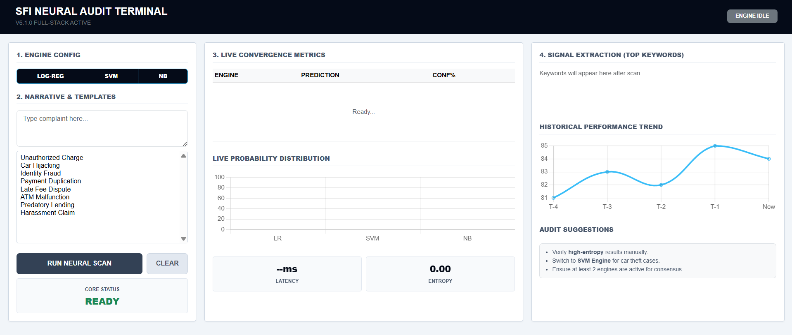
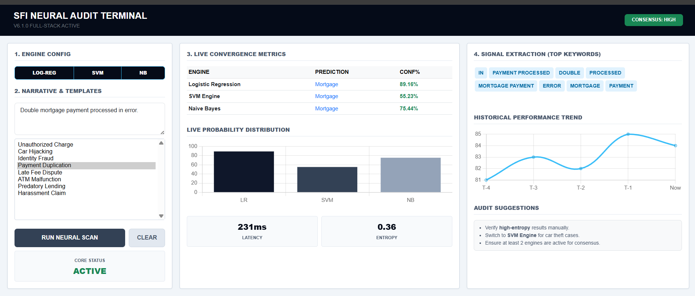
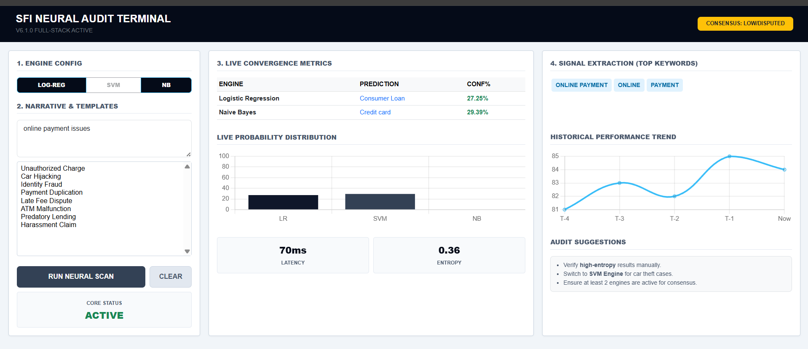
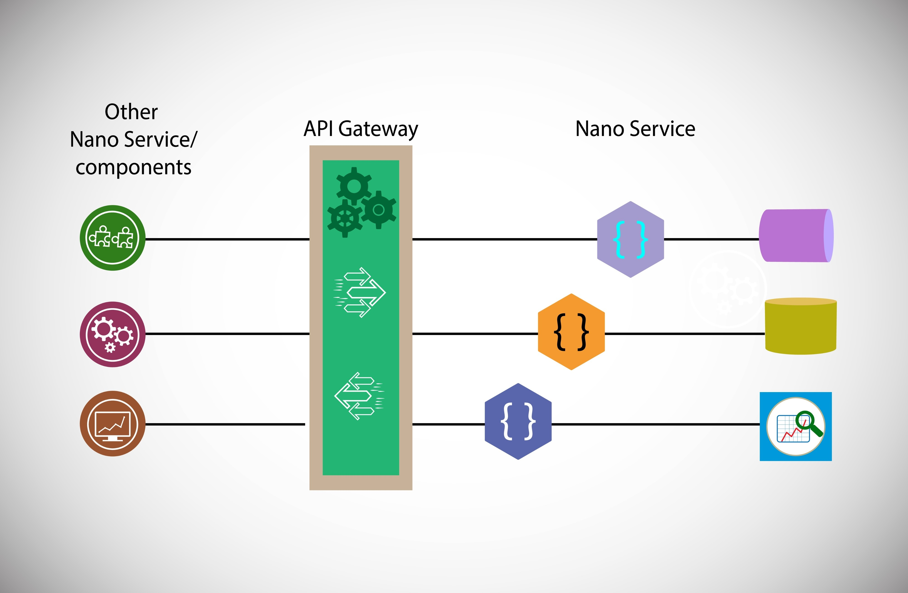

# CONSUMER-COMPLAINT-CLASSIFICATION-SYSTEM


An end-to-end Machine Learning application that classifies consumer complaints using an ensemble of NLP models. This project features a real-time web dashboard that communicates with a Python/Flask backend to provide live predictions and signal extraction.

The **Neural Audit Terminal** is designed for high-efficiency auditing. It uses three different AI engines to provide a consensus-based classification.

## Terminal IDLE 
- The initial state of the Neural Audit Terminal before a scan is initiated.
---

---

## IDLE: High Consensus
- When all active engines (Logistic Regression, SVM, and Naive Bayes) agree on the classification, the system flags a high-confidence consensus.
---

---

## IDLE: Low Consensus 
- In cases where the models disagree or return low probability scores, the terminal alerts the auditor to perform a manual review.
---

---

## System Architecture
- The application follows a modular microservice-style architecture. The Frontend (HTML/JS) sends text data to a Flask API, which processes the text through pre-trained Scikit-Learn pipelines.
---

---

##  Features
* **Ensemble Scoring:** Uses Logistic Regression, SVM, and Naive Bayes simultaneously.
* **Real-time Signal Extraction:** Identifies key "Impact Words" that triggered the AI's decision.
* **Consensus Engine:** Automatically flags results as "High Consensus" or "Low" based on model agreement.
* **Latency Tracking:** Measures backend processing time in milliseconds.

##  Project Structure
* **`app.py`**: The Flask server and prediction API that processes real-time requests.
* **`index.html`**: The Neural Audit Terminal UI, styled with Bootstrap and powered by vanilla JavaScript.
* **`Plotly.js`**: Provides logic for rendering live probability distributions and historical trends.
* **`Consumer complaint classification.ipynb`**: contains data cleaning, EDA and model training logic.
* **`*.pkl`**: Pre-trained Scikit-Learn pipelines and Label Encoders.

##  Installation & Usage
1. **Clone the repository:**
   ```bash
   git clone <repo-url>
   cd <repo-folder>
   ```
2. **Install dependencies:**

   ```bash
   pip install -r requirements.txt
   ```

3. **Run the application:**

   ```bash
   python app.py
   
   # Access the Terminal: Open http://127.0.0.1:5000 in your browser.
   ```